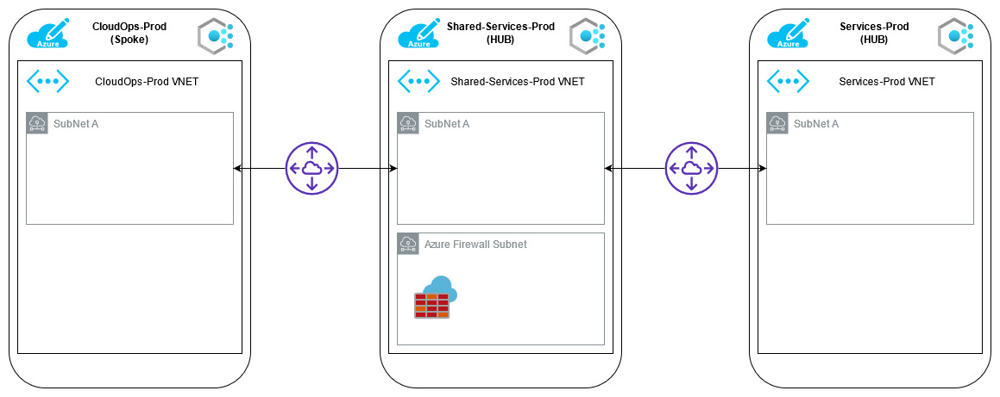

# Azure Account Template

Azure Account Template deployed via [lolite](https://github.com/NathanKewley/lolite)

deploy with: `lolite deploy-account`

This does assume the subscriptions already exist.

* Hub and Spoke network across mulitle subscriptions
* Azure Firewall
* Azure Policy places at a subscriptions layer. (Azure Blueprints might be a better solution for policy assignments)

